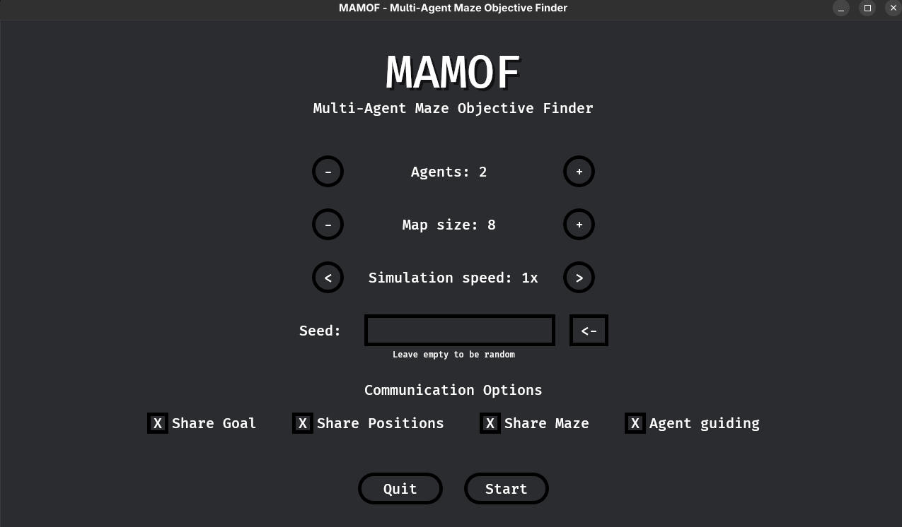
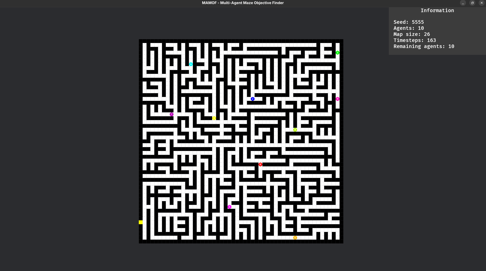
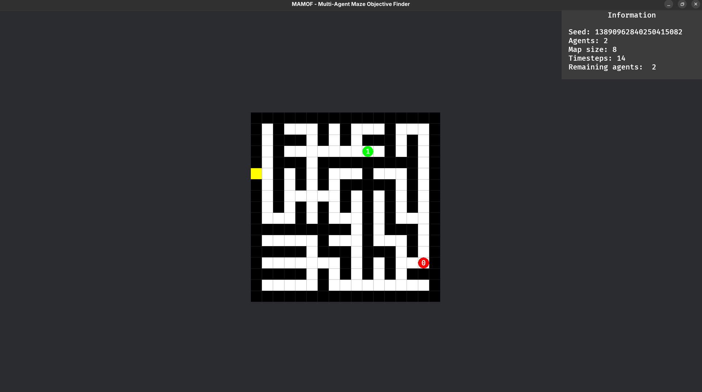
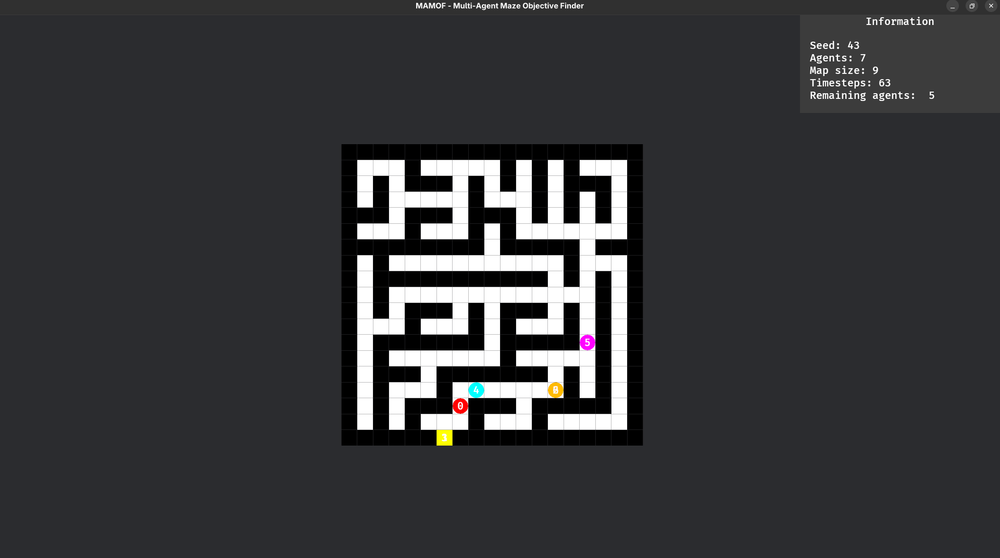

## MAMOF - Muti-Agent Maze Objective Finder


  

|  |  
|---------------------------------------|---------------------------------------|


### Developed by:
**Group 05**
- Xiting Wang - 112191
- Laura Cunha - 112269
- Rodrigo Correia - 112270


---
### How to Compile
1. Make sure you have **Rust** installed.
2. To compile the simulation, run the following command in the root of the project:
```bash
cargo build --release
```


---
### How to Run
- To run the simulation with the **graphical interface**, run in the root of the project:
```bash
cargo run --release
```

- To run the simulation in **headless mode**:
1. Run the exutable that is in the path ```./target/release``` from the root of the project (use the ```--help``` flag to see all available options, which match those in the interface):
```bash
./target/release/mamof --help
```
2. Repeat the previous step, but now with the desired flags and values, e.g.:
```bash
./target/release/mamof --headless -n 2 -m 8 --simulation-speed x128 -s 12345 -o output.json
```

---
### Simulation Parameters
You can configure the simulation using the following parameters:

- **Number of agents:** number of agents in the simulation
- **Map size:** size of the map
- **Simulation speed:** speed the simulation
- **Seed:** random seed of the maze

- **Comunication Options:**
    - **Share goal:** share the position of the goal
    - **Share positions:** share positions of the agents
    - **Share maze:** share explored tiles of the map
    - **Agent guiding:** backtrack for guide agents


---
### Controls
Keybindings to control the simulation:
- **Esc** - Go back
- **Mouse drag** - Move the map
- **Mouse scroll** - Zoom in/out
- **Right arrow** - Advance the simulation by 1 step
- **Spacebar** - Pause the simulation


---
### Results
To obtain the results, from the root of the project, run the following:

1. Run the script that executes the simulation with 20 seeds and 5 different configurations:
```bash
./run_all_configs.sh
```
- **config1** - no flags
- **config2** - share positions only
- **config3** - share positions and goal
- **config4** - share positions, goal, and maze tiles
- **config5** - all flags (share positions, goal, maze tiles, and guiding)

for the setups:
- 2-agent, 8x8 grid
- 5-agent, 8x8 grid
- 32-agent, 64x64 grid

2. To generate the plots based on the configurations that were run, execute the following command. 
The plots will be saved in the `./results/plots` folder:
```bash
./make_plots.sh
```
